<h1> flashlink</h1>

A personal, self-hosted file sharing tool. Upload a file to **your own Cloudflare account** and get back a **short, public link that expires on its own.**

<p align="center"></p>

```
$ fl up screenshot.png --ttl 2h
✓ screenshot.png (1.2 MB) · expires 14:32
https://fl.example.com/k3F9xQ2m
```

## The problem

Getting a local file in front of a coding agent, especially one running on another machine, is clumsy. Attaching, pasting and `scp` all take effort, and public upload services keep your file up forever.

flashlink makes it one command (or one right-click): upload, get a short URL on your clipboard, and the URL **stops working by itself**, after an hour unless you say otherwise. Changed your mind? Re-open the same link later.

**Good for:** screenshots, logs, build artifacts, zipped project folders, videos, or any file you want to hand to an agent or a teammate without leaving it lying around.

- **Agent-friendly links.** 8-character code, served directly: no redirect, no login, no JS. An agent can just `curl` it.
- **Self-expiring.** Default 1 hour, up to 7 days. Expired links return `410 Gone`.
- **Refreshable.** `fl refresh <code>` re-opens the _same_ link; `fl revoke <code>` closes it early.
- **Your own service.** There is no hosted flashlink and no account to create. One setup command deploys a Worker, a Durable Object and a private R2 bucket to your Cloudflare account (the free plan is enough), and you are its only user.
- **Token-secured.** Uploading, refreshing and revoking need your secret upload token, generated during setup and stored as a Worker secret. The bucket is never public and there is no way to list files. Anyone you give a link to can read that file until it expires.
- **Safe defaults.** `fl` warns before uploading anything that looks like a secret, your history stays on your machine, and size and storage limits keep costs bounded.

## Quick start

You need a Cloudflare account, Node 22.12+ and [pnpm](https://pnpm.io).

**1. Deploy your own** (once; one command after logging in to Cloudflare):

```sh
git clone https://github.com/crcatala/flashlink && cd flashlink
pnpm install
pnpm --filter @flashlink/worker exec wrangler login
pnpm setup:cloudflare
```

It prints your Worker's URL and your upload token (shown once, so save it). More options: [`docs/DEPLOY.md`](docs/DEPLOY.md).

**2. Install the CLI** (macOS or Linux, Node 22.12+):

```sh
npm i -g flashlink
fl init --endpoint https://flashlink.<you>.workers.dev   # prompts for your token
```

**3. Share a file:**

```sh
fl up screenshot.png
```

The link is printed and copied to your clipboard.

## Common usage

```sh
fl up report.pdf                    # upload; prints the URL and copies it
fl up build.log --ttl 15m           # custom lifetime: 30s, 15m, 2h, 1d, 1h30m
fl up a.png b.png                   # one link per file
fl up my-project                    # a folder: uploads my-project.zip
fl up big.zip -d 3                  # stop serving after 3 downloads
cat trace.txt | fl up --name trace.txt   # from stdin

fl ls                               # your upload history (local)
fl refresh k3F9xQ2m --ttl 30m       # same link, new window (no argument: the latest)
fl revoke k3F9xQ2m                  # close it now
fl status                           # server limits and usage
```

Only the URL goes to stdout, so it composes: `curl -s "$(fl up shot.png --no-copy)"`. Add `--json` for scripts. Everything else (folders, download limits, the secret warning, config, environment variables) is in the [CLI reference](docs/CLI.md).

## Finder Quick Action (macOS)

Right-click a file in Finder → **Quick Actions → Share via flashlink**, pick a lifetime, and a notification shows the link (also on your clipboard). Multiple files get one link each; folders are zipped.

```sh
curl -fsSL https://github.com/crcatala/flashlink/releases/latest/download/install.sh | sh -s -- --latest
~/.local/share/flashlink/bin/fl init --endpoint https://flashlink.<you>.workers.dev
```

Then enable the actions once in System Settings → Keyboard → Keyboard Shortcuts → Services → Files and Folders. No Node needed. Details, update, uninstall and troubleshooting: [`docs/MACOS.md`](docs/MACOS.md).

## Use it with coding agents

An agent skill teaches Claude Code (and other agents that read markdown instructions) to upload files, refresh expired links and revoke what it no longer needs:

```sh
mkdir -p ~/.claude/skills/flashlink
curl -fsSL https://raw.githubusercontent.com/crcatala/flashlink/main/skills/flashlink/SKILL.md \
  -o ~/.claude/skills/flashlink/SKILL.md
```

The agent also needs `fl` and your `FLASHLINK_ENDPOINT` / `FLASHLINK_TOKEN`. The token is not scoped, so read [`docs/AGENT_SKILL.md`](docs/AGENT_SKILL.md) before handing it to an agent.

## How it works

```
 fl / Quick Action ──upload──────▶ Worker ──▶ R2 (private bucket)
                                   │
 agent ──GET /k3F9xQ2m──▶ Worker ──┼──▶ Registry Durable Object (code → object, expiry)
                                   └──▶ streams the object if the link is live
```

R2 stays private. The Worker checks expiry on every request, which is what lets a short link stay stable across refreshes. The Durable Object only holds metadata; file bytes go straight between the Worker and R2. Architecture, cost model and design decisions: [`docs/ARCHITECTURE.md`](docs/ARCHITECTURE.md).

## Docs

| Doc                                            | What's in it                                                     |
| ---------------------------------------------- | ---------------------------------------------------------------- |
| [`docs/DEPLOY.md`](docs/DEPLOY.md)             | Deploy by script or by hand, limits, custom domain, verification |
| [`docs/CLI.md`](docs/CLI.md)                   | Every command, folders, download limits, secret warning, config  |
| [`docs/MACOS.md`](docs/MACOS.md)               | Finder Quick Action: install, how it works, troubleshooting      |
| [`docs/AGENT_SKILL.md`](docs/AGENT_SKILL.md)   | The agent skill and giving an agent access safely                |
| [`docs/ARCHITECTURE.md`](docs/ARCHITECTURE.md) | Architecture, decisions, roadmap                                 |
| [`docs/DEVELOPMENT.md`](docs/DEVELOPMENT.md)   | Repo layout, running and testing locally, CI                     |
| [`CHANGELOG.md`](CHANGELOG.md)                 | Release notes                                                    |

## Releases (maintainers only)

See [`RELEASING.md`](RELEASING.md) for prerequisites, the first release and recovery steps.

## Contributing and security

This is a personally maintained project and is not accepting code contributions; see [`CONTRIBUTING.md`](CONTRIBUTING.md) for bug reports, security issues and forks. It is available under the [MIT License](LICENSE), © 2026 Christian Catalan.
