# flashlink: architecture

How flashlink is built and why. For using it, start with the [README](../README.md). Phases 1 and 2 (Worker, CLI, landing page, Finder Quick Action) are implemented, and so are the folder zip and the agent skill; see [section 9](#9-status-and-roadmap).

## 1. Problem and goals

Sharing a local file with a coding agent (usually one running on a different machine) is clumsy. Attaching, pasting, or scp-ing all take effort, and public upload services leave the file up forever.

flashlink makes it a one-step action:

1. Upload a file from the CLI or Finder to **my own** R2 bucket.
2. Get a **short** public URL back.
3. The URL **stops working on its own**, by default after 1 hour.
4. Later I can **re-open the same URL** for another window.

Goals

- Fast path: one command, or one right-click, from file to URL on the clipboard.
- Agent-friendly links: the plain short link serves the raw bytes with a correct `Content-Type`. No redirect chain, no HTML interstitial.
- Expiry is configurable globally and per upload, with server-enforced ceilings.
- Sane limits on size and storage. The tool must not be able to run up a bill.
- Local-only history of uploads and links, with refresh and revoke.
- Single-user and trivially self-deployable: fork it and deploy it to your own Cloudflare account.

Non-goals

- Multi-user accounts, sharing permissions, or a hosted service.
- A web UI for uploading or listing. The web surface is a static landing page.
- Windows support (CLI targets macOS and Linux).
- Resumable or multipart uploads (50 MB default cap; see [section 9](#9-status-and-roadmap)).

## 2. Architecture

<p align="center"></p>

In detail:

```
┌────────────┐   POST/PUT /api/links (bearer token)
│   fl CLI   │─────────────────────────────────────────┐
│ Quick Act. │                                         ▼
└────────────┘                              ┌────────────────────┐
                                            │   Cloudflare Worker │
┌────────────┐   GET /<code>[/name]         │   (Hono)            │
│   agent    │─────────────────────────────▶│                     │
└────────────┘                              │  1. validate code   │
                                            │  2. rate-limit      │
        static landing page (assets) ◀──────│  3. ask registry    │
                                            │  4. stream from R2  │
                                            └───┬────────────┬────┘
                                                │ RPC        │ get/put
                                                ▼            ▼
                                   ┌──────────────────┐  ┌───────────┐
                                   │ Registry DO      │  │ R2 bucket │
                                   │ (SQLite, 1 inst) │  │ (private) │
                                   │ + sweeper alarm  │  └───────────┘
                                   └──────────────────┘
```

### Components

**Worker** (`packages/worker`)

- Public routes: `GET|HEAD /<code>` and `/<code>/<anything>`.
- Authenticated routes (`Authorization: Bearer <token>`), under `/api`:
  - `POST /api/links`: upload, allocates a new code.
  - `PUT /api/links/:code`: upload under a specific code. Used to re-create a link whose object has already been purged. `409` if the code exists.
  - `GET /api/links/:code`: metadata and hit count.
  - `POST /api/links/lookup`: batch metadata for many codes (used by `fl ls --sync`).
  - `POST /api/links/:code/refresh`: set a new expiry from now.
  - `POST /api/links/:code/revoke`: expire immediately (still refreshable during the grace window).
  - `DELETE /api/links/:code`: purge the object and row immediately.
  - `GET /api/status`: effective limits and current usage.
- Static assets: the landing page. Asset requests are served by the platform without invoking the Worker; only unmatched paths (codes, `/api/*`) reach Worker code.

**Registry Durable Object** (`Registry`, SQLite-backed, exactly one instance)

- Table `links(code PK, r2_key, filename, content_type, size, created_at, expires_at, max_downloads, hits, last_hit_at, state)` where `state` is `pending` (allocated, bytes not yet committed) or `active`.
- Atomic operations: allocate a code (collision-free), commit an upload, resolve-and-count a fetch, refresh, revoke, purge.
- Quota enforcement: total stored bytes and uploads per day.
- A single **sweeper alarm** that deletes R2 objects and rows once `expires_at + GRACE` has passed, and reaps stale `pending` rows.

**R2 bucket**: private, no public access and no custom domain on the bucket. Object key is `objects/<code>`. An R2 lifecycle rule (30 days, `wrangler r2 bucket lifecycle add`, documented in [DEPLOY.md](DEPLOY.md) because lifecycle rules can't live in `wrangler.jsonc`) deletes anything older than the max retention plus grace as a backstop for orphans.

**Shared core** (`packages/core`): API types, duration parsing, API client, constants shared by CLI and Worker.

**Landing page**: static HTML and CSS with light branding, what the tool is for, the CLI quickstart, a repo link, and "fork it and deploy your own".

**CLI** (`packages/cli`, binary `fl`): TypeScript on Node 22.12+, Linux and macOS. Commands: `up`, `refresh`, `revoke`, `ls`, `status`, `config`, `init`. Design points:

- Only the URL goes to stdout (scriptable); human-readable details go to stderr. The URL is copied to the clipboard when a clipboard tool exists.
- Config is in `~/.config/flashlink/config.json` (mode 600) and history in `~/.local/share/flashlink/history.json`; both honor `XDG_*`.
- **`--json` errors.** Any failure is a single compact `{"error": <code>, "message": ...}` line on stdout with stderr empty and exit code 1, including option-parse errors (`--json` is detected from argv). With several files, `up --json` prints one array with per-file results and errors. This lets wrappers such as the Quick Action parse failures.
- **`--notify` (macOS).** Posts one notification per invocation: the link(s) on success, the error on failure. Text is escaped for AppleScript string literals because file names and URLs are untrusted. It implies a clipboard copy unless `--no-copy`, and does nothing on other platforms. Delivery sits behind `Context.notify` so tests inject a recorder.
- **Secret warning** (`src/secrets.ts`). Before uploading, the file name is matched against a short list and, for text files, the first 2 MiB is scanned for a few high-signal patterns (rules in [CLI.md](CLI.md#secret-warning)). Findings are a rule name plus line numbers and never contain the matched text, so the warning cannot leak a secret into a terminal log or notification. With a terminal it asks `[y/N]`; without one (scripts, stdin, the Quick Action, and always with `--json`, whose contract is a quiet stderr) it refuses with an error naming the override, because nobody can be asked. The real file name is checked even when `--name` renames the upload. The generic `api_key` pattern requires a value that looks like a secret, since a bare `api_key =` would flag `apiKey: string` in any source file. It is a safety net, not a scanner.
- **Folder upload** (`src/folder.ts`, `src/zip.ts`). `up <dir>` uploads `<dirname>.zip`. Decisions:
  - **No system `zip`, no temp file.** A small in-memory writer on `node:zlib` (no npm dependency). A Quick Action's minimal `PATH` is one more thing that can fail; in-process code controls symlinks and the size cap precisely; and a plaintext copy of possibly sensitive files in `/tmp` is a worse failure than the cap. Consequence: no zip64, so at most 65535 files and 4 GiB (the cap is far below).
  - **Size cap** applies to the zipped size and aborts as soon as the running size passes it. One early guard: a folder whose files total more than 20 times the cap is refused before reading anything, since the whole zip is held in memory.
  - **File list** comes from `git ls-files -z --cached --others --exclude-standard` inside a repository, and a directory walk otherwise. If git fails inside a repository it is an **error** that names `--no-gitignore`, never a fallback to the walk, because the walk does not know `.gitignore` and would upload files the user ignored on purpose. `--exclude` is a small gitignore-style matcher (no negation).
  - **Symlinks.** Every candidate is resolved with `realpath` and kept only if it is a regular file inside the folder, so a symlinked parent folder cannot escape either. Others are skipped and counted.
  - **Secret check** runs per member while zipping, so the compressed bytes are never scanned and the warning names the files.
  - **Refresh after purge** is refused for folders: a zip is not reproducible (timestamps, exclusions), so the old bytes cannot be rebuilt or compared.

**macOS Quick Action** (`macos/`): two Automator Quick Actions (Finder files and folders) whose single "Run Shell Script" action calls the installed wrapper `~/.local/bin/fl-quick`, which runs `fl up --notify --ttl <choice> -- <files>`. User guide: [MACOS.md](MACOS.md). Design points:

- **PATH.** Quick Actions run with `/usr/bin:/bin:/usr/sbin:/sbin`, and with a version manager such as mise the real `fl` lives in a folder that only an interactive `~/.zshrc` adds. The installer records the directories of `fl` and `node` from the Terminal it runs in (`<config dir>/quick-action-path`, also the hand-editable override). The wrapper runs every `fl` call in `/bin/zsh -l -c` with those directories prepended and, on exit 126/127, retries once with `-l -i` so `~/.zshrc` is read. If everything fails, a fixed-text notification says to re-run the installer, because `fl` never started and could not report itself. The installer verifies the result through the installed wrapper under `env -i` with the minimal `PATH`, never with the Terminal's `PATH`. Rejected: an absolute path baked into the workflow (breaks on upgrade) and bypassing the CLI with `curl` (duplicates config, TTL and error handling in shell).
- **Standalone binary.** `scripts/build-binary.sh` compiles the unchanged CLI with `bun build --compile` (cross-compiles; about 62 MB for arm64, 69 MB for x64). The installer puts it at `<data dir>/bin/fl` (with a `flashlink` symlink), strips quarantine, ad hoc signs it and checks it starts under `env -i`. The wrapper prefers it and falls back to the login-shell lookup on exit 126/127. One code path (the TypeScript CLI) and no dependency on the user's Node. Node single-executable applications were tried and dropped: they need a CommonJS bundle (the entry point uses top-level `await`) and a Node binary carrying the SEA fuse.
- **Notifier applet.** Notifications posted through `osascript` belong to Script Editor, so a click opened its Open dialog. The installer builds a tiny applet with `osacompile` into `<data dir>/notify/flashlink.app` (no Dock icon, ad hoc signed). The CLI writes the subtitle and text to `notify/pending/<unique>` and runs `open -g -j` on it; the applet posts and deletes them. A click does nothing, by design: a click cannot say which notification it came from, so "open the link" would be wrong for older or multi-file notifications (the link is on the clipboard). The folder is mode 700 and files 600 because messages hold links; they are written under a dot name and renamed so the applet never reads a half-written one. If the applet is missing, the plain `osascript` path is used.
- **Lifetime picker.** `osascript` `choose from list` with fixed AppleScript source. The items and the preselected default (`fl config get defaultTtl`) are passed as arguments, so config text or file names can never become AppleScript source. Cancel exits 0 with no upload and no notification.
- **No guessing.** If `fl config get defaultTtl` fails with anything other than 126/127, the notification carries `fl`'s own message rather than a PATH hint. A `defaultTtl` that is not a duration aborts with a notification instead of falling back to `1h`: silently picking a longer lifetime than configured would keep a file public for longer than intended.
- **Opt-out.** Finder cannot set environment variables or flags, so the "no picker" mode is a second Quick Action, "Share via flashlink (default lifetime)", calling the wrapper with `--no-prompt`. A test keeps the two bundles consistent.
- **Files.** The installer copies the two `.workflow` bundles (checked-in plists with no token, endpoint or home path) and the wrapper, clears quarantine, runs `pbs -flush`, and warns if a login shell cannot find `fl` and `node`. The uninstaller removes exactly those.
- **Testing.** The wrapper, installer and bundles are tested on Linux (`packages/cli/test/macos.test.ts`) with a fake `fl`, `osascript` and login shell injected through `FLASHLINK_QUICK_SHELL` / `FLASHLINK_QUICK_OSASCRIPT`. The hand-written `.workflow` plists pass `plutil -lint` on macOS 26.6.2, Finder loads and runs them, and the guided `macos/qa.sh` passed there (see the [QA checklist](MACOS.md#manual-qa-checklist)).

### Request flows

**Fetch** (`GET /<code>`)

1. Reject malformed codes with `404` (regex; nothing else is touched).
2. Per-IP rate limit, then global rate limit (both before any DO call).
3. One DO call: look up the code and, for a `GET` that counts as a download (every satisfiable `GET`; see [download-cap accounting](#download-cap-accounting)), count the hit, in a single atomic operation. Returns the metadata or `notfound`/`expired`/`exhausted`.
4. `404` unknown, `410` expired, revoked or out of downloads.
5. Otherwise the Worker streams the object from R2 directly (the DO never touches file bytes), honoring `Range`.

**Upload** (`POST /api/links`)

1. Authenticate, rate-limit.
2. Require `Content-Length`; reject over the size cap with `413` before reading the body. (On real Cloudflare a chunked request body is buffered by the edge, which supplies the length, so a client that omits it is not refused with 411 but is still held to the cap with 413.)
3. DO `allocate(meta)`: checks quota, picks a unique code, inserts a `pending` row, returns the code and R2 key.
4. Worker streams the body to R2 (`env.BUCKET.put`).
5. DO `commit(code)`: marks the row `active`, returns the final metadata. Two DO calls per upload; none while bytes move.

**Refresh / revoke**: a single DO call each. Refresh sets `expires_at = now + ttl`, resets the per-window download counter, and rejects a TTL above `MAX_TTL_SECONDS` with a clear error instead of silently clamping it. If the object has been purged, the CLI can re-upload from the original local path (verified by hash) using `PUT /api/links/:code`, so the short link is preserved.

## 3. Key decisions and rationale

| Decision                                                            | Why                                                                                                                                                                                                                                             |
| ------------------------------------------------------------------- | ----------------------------------------------------------------------------------------------------------------------------------------------------------------------------------------------------------------------------------------------- |
| R2 bucket private; Worker serves objects                            | Expiry must be enforceable and **refreshable under the same short URL**. Presigned URLs are long, and change on every refresh.                                                                                                                  |
| Expiry is server-side state, not an R2 feature                      | Same reason. It also allows revoke-now and download caps.                                                                                                                                                                                       |
| Short code is 8 random base58 characters                            | 58⁸ ≈ 1.3×10¹⁴. At 10 live links and 1,000 guesses/s, the expected time to hit one is about 400 years, and links live about an hour. Codes are never sequential or derivable.                                                                   |
| Link served directly at `/<code>`; filename suffix optional         | Agents fetch with `curl`/WebFetch; redirects and interstitials break them. The suffix is cosmetic (type hints) and ignored.                                                                                                                     |
| One SQLite-backed Durable Object as the registry                    | Strongly consistent allocate/refresh/revoke (KV is eventually consistent), atomic code allocation, and alarms for cleanup. D1 would also work; the DO fits and keeps the free-plan path (SQLite-backed DOs are the only kind on the free plan). |
| **Exactly one** DO instance, never one per link or IP               | Instance count is the classic DO cost trap. One instance has a bounded duration cost (section 5).                                                                                                                                               |
| The DO returns metadata only; the Worker streams bytes              | Proxying bodies through a DO burns duration and memory.                                                                                                                                                                                         |
| Two-stage expiry: `410` at `expires_at`, purge at `expires_at + 7d` | Refresh stays possible for a week without keeping data forever.                                                                                                                                                                                 |
| No content-addressed dedup                                          | Refcounting on delete adds complexity for little gain at personal scale.                                                                                                                                                                        |
| History is local-only                                               | The server needs no listing endpoint, which keeps the public surface minimal. The cost: each machine has its own history.                                                                                                                       |
| Single static bearer token                                          | Single-user by design. Token is a Wrangler secret generated at deploy time.                                                                                                                                                                     |
| Static landing page served by the same Worker                       | One deploy, one domain, and static asset requests don't invoke the Worker.                                                                                                                                                                      |
| TypeScript monorepo (pnpm workspaces)                               | One language across Worker, CLI and shared types. Swift is deferred to a possible later menubar app.                                                                                                                                            |
| Quick Action before a native app                                    | Gives the Finder right-click experience for roughly 30 minutes of work.                                                                                                                                                                         |

## 4. Security and abuse prevention

Anyone holding a link can fetch the file until it expires. The risks are guessing codes, hammering the endpoint, and serving hostile content.

1. **Entropy.** CSPRNG (`crypto.getRandomValues`) with rejection sampling to avoid modulo bias.
2. **Cheap rejection.** Malformed codes get `404` from a regex check, with no DO call.
3. **Per-IP rate limit** before any DO call (default 60 requests/min, keyed on `CF-Connecting-IP`).
4. **Global rate limit** before any DO call on the **public fetch path**: a circuit breaker on total anonymous DO-bound traffic (default 300 requests/min). It is not applied to authenticated `/api` calls, so a fetch flood can't lock you out of uploading. Trade-off: an attacker could trip it and temporarily deny real fetches; for a personal tool, cost safety wins. Tunable.
5. **Upload auth.** Constant-time token comparison (both sides hashed first, so length doesn't leak). The token is high entropy (256-bit); the per-IP limit applies to `/api` too, which bounds guess rate. A separate "failed auth" limiter was considered and dropped: the rate-limit binding counts every call, so it can't gate on failures without also consuming successes.
6. **No enumeration surface.** No list endpoint. `X-Robots-Tag: noindex`, `robots.txt`.
7. **Per-link controls.** Optional `--max-downloads`, revoke-now, purge.
8. **Upload-side caps** (enforced in the DO): per-file size, total stored bytes, uploads per day. A leaked token can't run up an unbounded R2 bill.
9. **Response hardening.** `X-Content-Type-Options: nosniff`, `Referrer-Policy: no-referrer`, `Cache-Control: no-store` (a cached response would outlive expiry), and `Content-Security-Policy: sandbox` on active content types (HTML, SVG, XML). `sandbox` is not applied to everything because it breaks inline PDF viewing in some browsers; with `nosniff`, non-active types can't execute.
10. **Edge backstops (documented, outside the Worker).** Cloudflare's automatic DDoS mitigation and an optional WAF rate-limit rule block traffic before the Worker runs, so blocked requests aren't billed.

Limits of the in-Worker rate limiter (measured on a real account: active, but it admitted roughly 3 to 10 times the configured rate; see [section 8](#8-real-account-verification)). Cloudflare documents the Rate Limiting binding as "permissive, eventually consistent, and intentionally designed to not be used as an accurate accounting system", and counters are **local to each Cloudflare location**. It is a deterrent, not a hard cap. The period can only be 10 or 60 seconds, and limits are set in `wrangler.jsonc`, not in runtime vars.

## 5. Cost model

Durable Object pricing (from Cloudflare's published pricing, checked 2026-10-02):

- **Free plan:** SQLite-backed DOs only; 100,000 requests/day and 13,000 GB-s/day. Past the limit, requests fail; nothing is billed.
- **Paid plan:** 1M requests/month included then $0.15/M; 400,000 GB-s/month included then $12.50/M GB-s; objects are billed as if they use a full 128 MB; SQLite rows read 25B/month included then $0.001/M; rows written 50M/month included then $1.00/M; storage 5 GB-month included then $0.20/GB-month. Each `setAlarm()` counts as one row written.
- Workers: 100,000 requests/day on free; on paid, 10M/month included then $0.30/M.

Design consequences:

- **Duration is effectively free.** A DO awake for an entire 30-day month at 128 MB uses 0.125 GB × 2,592,000 s ≈ 324,000 GB-s, which is under the 400,000 GB-s included in the paid plan. This only holds with a **single instance** and a design that never keeps extra objects alive.
- **Requests are the only real exposure**, and they scale linearly and mildly: 100M DO requests in a month ≈ $15 plus Worker request charges. There is no runaway multiplier.
- **Nothing that keeps a DO awake or multiplies instances:** no WebSockets, no `setInterval`/`setTimeout` loops, no unawaited work, no per-user or per-IP objects, no file bytes through the DO.
- **The sweeper alarm is scheduled only for the next due cleanup** and reschedules only if rows remain. With no live links, no alarm is pending and the DO sits idle. There is no periodic heartbeat.
- **Pre-DO filtering** (regex, per-IP and global limits) keeps most junk traffic away from the DO.
- **R2:** misses stop at the DO lookup, so only valid live links cause R2 reads. R2 has no egress fees.

Honest caveat: because the rate limiter is per-location and approximate, the global limit is a deterrent. A widely distributed flood could exceed it. The hard backstops are Cloudflare's DDoS protection, an optional WAF rule, and billing alerts ([DEPLOY.md](DEPLOY.md) tells paid-plan users to enable usage notifications).

## 6. Defaults and configuration

| Setting            | Default                                             | Where                                            |
| ------------------ | --------------------------------------------------- | ------------------------------------------------ |
| Default TTL        | 1 hour                                              | client config (`defaultTtl`), per-upload `--ttl` |
| Max TTL            | 7 days                                              | Worker var `MAX_TTL_SECONDS`                     |
| Max file size      | 50 MB (hard ceiling 100 MB, the Workers body limit) | Worker var `MAX_FILE_BYTES`; client pre-check    |
| Total stored bytes | 2 GB                                                | Worker var `MAX_TOTAL_BYTES`                     |
| Uploads per day    | 200                                                 | Worker var `MAX_UPLOADS_PER_DAY`                 |
| Grace before purge | 7 days                                              | Worker var `PURGE_GRACE_SECONDS`                 |
| Per-IP limit       | 60 req / 60 s                                       | `ratelimits` in `wrangler.jsonc`                 |
| Global limit       | 300 req / 60 s                                      | `ratelimits` in `wrangler.jsonc`                 |
| Code length        | 8 base58 chars                                      | constant                                         |

Durations accept `30s`, `15m`, `2h`, `1d`.

## 7. Distribution and releases

- **One version, one tag.** Plain `X.Y.Z` (no prereleases). The private root `package.json` is bumped by `pnpm release` and copied into `packages/cli/package.json`; that is what the npm package, the binaries and `fl --version` show. `scripts/check-release-tag.mjs` fails the release workflow if the two differ or the tag is not `v<version>`. Procedure: [RELEASING.md](../RELEASING.md).
- **npm is published by hand, not by CI.** No `NPM_TOKEN` exists, so no CI job can publish, and since npm provenance can only come from a supported CI provider the package has none. release-it is configured with `github.release: false` and `npm.publish: false`: the GitHub Release needs binaries built in CI, and npm's one-time-password prompt does not work inside a release-it hook, so publishing is a separate step (`scripts/release.mjs publish`) with inherited stdio. It refuses unless it is on a clean `main`, `HEAD` is tagged `v<cli version>` and that tag is on `origin` at the same commit (so npm and the GitHub Release can never get different code), the version is not on npm yet and you are logged in.
- **GitHub Release.** The `v*` tag runs `.github/workflows/release.yml`: it refuses a tag that does not match the version or has no changelog entry, runs the normal checks, builds both darwin binaries on a Linux runner (Bun cross-compiles, so no macOS minutes) and creates the release with the changelog section as notes, plus `flashlink-macos-support.tar.gz` (the `macos/` folder), `install.sh`, `uninstall.sh` and `SHA256SUMS` covering all of them.
- **Install on macOS.** `install.sh --latest` (or `--version vX.Y.Z`) downloads the binary for this Mac's architecture and the Quick Action files from the same release, verifies them against `SHA256SUMS`, and installs as `--binary` does. The new binary is staged as `fl.new`, signed and started there, and only then moved over the installed one, so a failed update keeps the working binary. Downloads use `curl` (which sets no quarantine flag) and fall back to `gh release download` for a private repository.
- **CI** has a PR-time `binaries` job that runs the same packaging script as the release, verifies the checksums and starts the linux-x64 binary, so a broken build is found before a tag. Bun is pinned.
- **Kept for now:** the login-shell fallback and recorded-PATH machinery, since a source install without Bun still needs them.
- **Out of scope:** hardened runtime and notarization (ad hoc signing is enough for a file fetched with `curl`), a Homebrew tap, auto-update. Alternatives rejected for releases: release-please (changelog only as good as commit subjects; tags made by the default token do not trigger workflows) and changesets (overkill for one published package).
- **Deploy button: not offered.** Cloudflare's docs say a subdirectory deploy must be fully isolated "including any dependencies", and `packages/worker` depends on the workspace package `@flashlink/core`. It also cannot add the lifecycle rule and needs a public repository. Revisit if Cloudflare gains workspace support. The setup script ([DEPLOY.md](DEPLOY.md)) replaces it.
- **Setup script decisions** (`scripts/setup.mjs`): deploy before setting the secret (`secret put` on a Worker that does not exist yet asks a question that cannot be answered unattended; a deployed Worker without the secret fails closed with a 500); never replace a token it could not read (a failing `secret list` stops the script rather than risk locking the CLI out); the token is printed once and never stored, and the printed `fl init` command does not contain it.
- **One name for the token** everywhere: the Worker secret, the CLI/script environment variable and the docs are all `FLASHLINK_TOKEN`. A Worker that only has the old `UPLOAD_TOKEN` fails closed with a message to set the new one.
- **`wrangler.jsonc`** sets `workers_dev: true` and `preview_urls: false` explicitly, because preview URLs would expose every uploaded version on extra public hostnames (same bucket, same secret).
- **License:** MIT. Runtime dependencies of the shipped CLI and Worker are MIT (`commander`, `mime`, `hono`); the other licenses in `pnpm licenses list` belong to development-only tooling that is not redistributed.

## 8. Real-account verification

The functional checks in [VERIFY_DEPLOYMENT.md](VERIFY_DEPLOYMENT.md) were run against a real `workers.dev` deployment on the free plan (2026-10-03). Results:

- **Everything functional passed:** auth, uploads from tiny to 49 MiB (49 MiB up in about 20 s, down in 2 to 4 s), 413 over the cap, Range/HEAD, `no-store` on every Worker response, expiry then 410, refresh keeping the URL, revoke, purge and re-upload under the same code, `--max-downloads`, and no `cf-cache-status` on any Worker response.
- **Sweeper:** with `PURGE_GRACE_SECONDS=20` an expired link was purged within seconds of becoming due and its row was gone.
- **Durable Object:** storage backend SQL and exactly one object (the dashboard lists it twice, once by name and once by bare ID; the same ID). 299 DO requests and 0 errors in the first 24 hours, covering about 270 scripted requests plus manual curls; no loop or junk traffic.
- **Lifecycle:** the `expire-strays` rule exists. Cloudflare also adds a default "abort incomplete multipart uploads after 7 days" rule.
- **Content-Length through the edge:** a chunked upload with no `Content-Length` was accepted (201), not refused with 411, because Cloudflare's edge buffers a chunked body and gives the Worker a length. The cap still holds: a chunked 60 MB upload got `413 file_too_large`. The verify script accepts either behavior and asserts the over-limit case is refused.
- **Rate limiter: active but lenient.** From one IP, 350 requests against the real limit (60/min) all returned 404, never 429. To tell "not enforcing" from "lenient", a temporary deploy with the per-IP limit at 3 requests per 10 s and 40 sequential requests got 9 refusals (429) and 31 let through. So the binding enforces, but admits several times the configured rate, because counts are cached per machine and synced in the background, as Cloudflare documents. Treat it as a coarse deterrent; the real backstops are an optional WAF rate-limit rule and billing alerts. `withinLimit` fails open if the binding throws, and logs `rate limiter failed open`.
- **Still open:** Worker and DO usage after about a day of normal use compared with [section 5](#5-cost-model), and the optional custom domain check.

## 9. Status and roadmap

Implemented:

- **Phase 1:** Worker, Registry Durable Object, `fl` CLI (`init`, `up`, `refresh`, `revoke`, `ls`, `status`, `config`), local history, landing page, tests against real DO and R2 simulations (workerd), and a deploy guide. `fl refresh` with no argument refreshes the most recent upload; `fl ls --sync` reconciles local history with the server.
- **Phase 2:** macOS Finder Quick Action, notifications, the standalone binary and installer.
- **Phase 3 (done):** folder upload as a zip, the agent skill (`skills/flashlink/SKILL.md`), the secret warning, `--max-downloads`, and `pnpm setup:cloudflare`.

Ideas, not committed:

- Upload from the clipboard (screenshots).
- An MCP server and scoped (restricted) tokens; the single token can currently manage every link. Decide after the skill has seen real use.
- **Large files:** above about 100 MB needs presigned multipart uploads direct to R2.
- **Edge cache** for popular links to save DO calls. Adds revoke lag (bounded by the cache TTL); only if measurements justify it.
- **Multi-device history** (opt-in sync) if local-only proves limiting.
- **A native Finder app** with a root-level menu. A Finder Sync extension signed only ad hoc (no paid account) was spiked on macOS 26.6.2 and is viable: the menu appeared at the root of Finder's context menu with a lifetime submenu, and every selected path arrived. It was deferred because the standalone binary solved the PATH problem with a single code path. If wanted later, it would be a thin Finder Sync shell that spawns that binary. The spike code is at the git tag `spike-finder-sync`.
- A more accurate rate limiter (a WAF rule or per-window byte accounting for downloads); keyed check characters in the codes (not adopted: they shrink the guess space); secret scanning beyond the built-in list is not planned.

### Download-cap accounting

`Registry.resolve(code, count, range)` counts a hit (`hits`, `window_hits`, `last_hit_at`) for every `GET` that is satisfiable, ranged or not, and never for `HEAD` or `416`. The registry gets the raw `Range` header and parses it with the same `parseRange` as the serve path, against the stored size, so a fetch is still exactly one DO call.

- **Ranged clients are not supported by `-d`.** A client that reads a file in several ranges (a video player, a resumable downloader, Safari's `bytes=0-1` probe) spends one count per request, so the last allowed request can leave it with a truncated file and later ones get `410`. `-d` is for plain full fetches (`curl`, `wget`, an agent).
- **Why every satisfiable range counts.** A first draft counted only requests with no `Range` or a range from byte 0. Review showed that `Range: bytes=1-` would then never be counted, so a link holder could read everything but the first byte of a capped link without limit. The cap fails closed (links close early, never late), which is worth more than ranged-client convenience. Once `window_hits >= max_downloads` even ranges get `410`.
- **Missing object:** a request that passes the registry but finds the R2 object gone still counts (checking R2 first would break the call order, and checking after costs an R2 operation on every fetch for a nearly unreachable case). A client that aborts mid-transfer still counts.
- **`hits` and `lastHitAt`** mean "counted fetches" and "when `hits` last increased" for every link, capped or not.
- A stronger policy, per-window byte accounting (count `served bytes / size` downloads so many small ranges of one file cost one), would let ranged clients work without reopening the hole. It needs a schema column and a migration of the live table and is not built.
